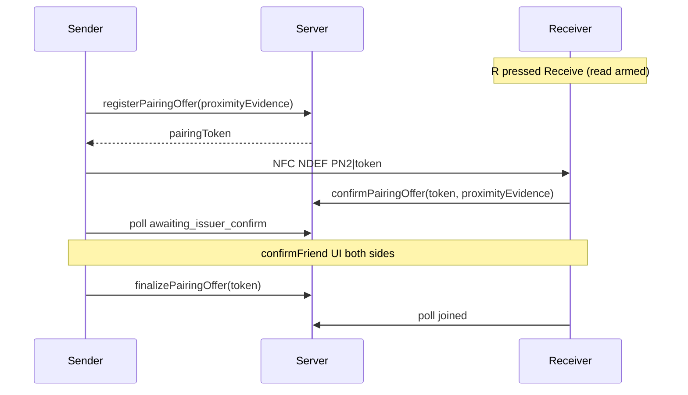

# NFC + QR unified in-person pairing plan

**Status:** Approved product / engineering plan (May 2026).  
**Goal:** NFC friending is **the same journey as QR** — same buttons, same phases, same server steps, same dual confirm — with only the **short-range transport** different. **No long-press / hold-to-pair** for NFC; users **press buttons** only.

**Related docs:** `Planning/QR_PROXIMITY_ADD_FRIEND_RULES.md`, `Planning/BLE_ADD_FRIEND_ARCHITECTURE.md`, `Planning/NFC_OPTIONS_AND_HS2_LEGACY.md`, `app/screens/AddFriendScreen.tsx`.

---

## 1. Why payment taps work but phone-to-phone friending is hard

Contactless **payments** (e.g. Xero + Stripe **Tap to Pay**) and **custom app NFC** are not the same problem.

| | **Payment tap (Xero-style)** | **Friend NFC (this app)** |
|--|------------------------------|---------------------------|
| **Roles** | **Terminal (reader)** + **card (wallet)** — always asymmetric | Two **general-purpose phones** — easy to get both wrong |
| **Protocol** | **EMV contactless** (certified kernel, decades of tuning) | **Custom NDEF text** via `react-native-nfc-manager` |
| **Payload** | Encrypted payment data; app does not choose a short string | App-defined session handle on the air |
| **“Reliability”** | Automatic frame retries inside payment stack; wallet optimized to be tapped | Manual NDEF write retries; peer write/read is fragile |

**Xero does not make phone-to-phone arbitrary data reliable.** It **avoids** that problem by using **payment rails** where one side always behaves as **a card** and the other as **a terminal**. We do **not** integrate Tap to Pay or EMV for friending.

**What we copy from payments (architecture only):**

- **One sender, one receiver** — never two writers or two readers.
- **Receiver arms first, sender acts second** (like “present card to terminal”).
- **Server settles** — the air link only delivers a **short-lived handle**; friendship is created only after proximity + dual confirm.

**What we do not copy:** payment payload size, Stripe APIs, or card emulation (except optional **Android HCE** later as a v2 hardening step — see §8).

---

## 2. Product intent

| Principle | Detail |
|-----------|--------|
| **Physical-first** | Friendship only from in-person pairing; no remote add-by-link. |
| **QR is the reliability baseline** | QR stays **default transport** until NFC passes device QA. |
| **NFC mirrors QR** | Same callables, same phases, same button pattern; NFC replaces camera/QR with read/write. |
| **Buttons only** | **No** long-press on the main Add Friend control for NFC. **No** “hold to pair” ritual. User taps **Send friend request** or **Receive friend request**. |
| **Opaque session handle** | OOB carries a **128-bit random token** (not a 4-digit PIN). Server doc id = that token. |
| **Server settles** | Proximity + dual human confirm unchanged. |

---

## 3. Session handle (replaces 4-digit PIN)

### 3.1 Why change

| | **4-digit PIN (legacy)** | **Opaque token (recommended)** |
|--|--------------------------|--------------------------------|
| Guessability | 10⁴ combinations | ~2¹²⁸ (16 random bytes) |
| NFC size | ~4–7 chars (+ NDEF overhead ≈ 25–45 B) | ~36 chars prefix+hex (+ NDEF overhead ≈ 60–90 B) |
| QR size | `AFQR1\|1234` (9 chars) | `AFQR2\|<32 hex>` (~38 chars) |

Still **tiny** compared to EMV contactless (hundreds of bytes). Size is **not** why payment works and friending fails — **RF roles** are.

### 3.2 Wire formats (versioned prefixes)

| Transport | Payload example | Parser |
|-----------|-----------------|--------|
| **QR** | `AFQR2\|a1b2c3…` (32 hex chars) | `parseQrPayloadToken` |
| **NFC** | `PN2\|a1b2c3…` (same 32 hex) or bare token if unambiguous | `parseNfcPairPlaintext` |

**Legacy (keep reading during migration):** `AFQR1\|<4-digit>`, `PN1\|<4-digit>` for older builds only.

### 3.3 Server

| Item | Detail |
|------|--------|
| **Collection** | Keep `nfcPinPairSessions` (name can stay; field semantics evolve). |
| **Document id** | **Opaque token** (e.g. 32 hex chars), not `0000`–`9999`. |
| **Mint** | `registerNfcPinPairOffer` — server generates token (or accepts client-proposed token if collision-safe); returns token to sender for NFC write / QR display. |
| **Collision** | Retry mint on id clash (negligible for 128-bit). |

Callable **names** may stay for wire compatibility; request/response fields gain `pairingToken` (keep accepting `pin` alias for one release if needed).

---

## 4. User-facing model (QR as the guide)

### 4.1 Controls on Add Friend

1. **Transport** (segmented): **QR** (default) | **NFC**
2. **Role toggle:** sender vs receiver (labels depend on transport)

| Transport | Left (internal `share`) | Right (internal `join`) |
|-----------|-------------------------|-------------------------|
| **QR** | **Show QR** | **Read QR** |
| **NFC** | **Send friend request** | **Receive friend request** |

Toggle disabled when `phase !== "idle"`.

### 4.2 Primary buttons (same pattern as QR)

| Role | QR mode | NFC mode |
|------|---------|----------|
| **Sender** | **Show QR Code** — mints offer, shows QR, polls for redeem | **Send friend request** — mints offer, writes NDEF once user pressed button |
| **Receiver** | Camera open; scan happens on sight | **Receive friend request** — arms read, then reads NDEF when sender sends |

**Explicit non-goals for NFC:**

- No long-press on the large Add Friend affordance to start NFC.
- No separate “hold Add Friend+” pairing ritual in NFC mode (`runInPersonPairingThenCelebrate` **not** used when `pairingTransport === "nfc"`).

### 4.3 Status copy (NFC)

**Receiver (idle, after choosing Receive):**  
“Tap **Receive friend request** when your friend is ready to send.”

**Receiver (after tap, `awaitPairing`):**  
“Listening… Ask your friend to tap **Send friend request**, then keep phones close for a moment.”

**Sender (after tap Send):**  
“Sending… Keep phones close to your friend’s phone.”

**On NFC failure:**  
“Couldn’t connect over NFC. Switch to **QR** and try again — same steps.”

(“Keep phones close” is guidance during the **automatic** read/write window after a button press — not a separate hold gesture.)

### 4.4 RF order (unchanged rule)

1. Receiver taps **Receive friend request** (read armed).  
2. Sender taps **Send friend request** (register + write).  

Same as historical “Receive first, Transmit second.”

---

## 5. Parity matrix: QR (guide) vs NFC

| Step | QR (reference implementation) | NFC (must match) |
|------|------------------------------|------------------|
| Open Add Friend | Location permission | Same |
| Choose transport | QR (default) | User selects NFC |
| Choose role | Show QR / Read QR | Send / Receive friend request |
| Sender action | Press **Show QR Code** | Press **Send friend request** |
| Mint offer | `registerNfcPinPairOffer` + `proximityEvidence` | **Same** → receive `pairingToken` |
| Deliver handle OOB | Display `AFQR2\|token` on screen; optional short visibility timer | Write `PN2\|token` via NDEF (`transmit`) |
| Receiver action | Camera scans QR (automatic on detect) | Press **Receive friend request**, then `read` NDEF (`receive`) |
| Parse handle | `parseQrPayloadToken` | `parseNfcPairPlaintext` |
| Automated request | `confirmNfcPinPairOffer` + joiner `proximityEvidence` | **Same** |
| Sender notified | Poll → `awaiting_issuer_confirm` | **Same poll** (no QR on screen) |
| Dual confirm | `confirmFriend` — **Confirm adding {name}?** | **Identical** |
| Sender confirm | `finalizeNfcPinPairOffer` | Same |
| Receiver confirm | Poll → `joined` | Same |
| Cancel / 30s timeout | `cancelNfcPinPairOffer` | Same |
| Screenshot security | Void QR + cancel offer | N/A (nothing to screenshot) |

---

## 6. End-to-end flows (NFC = QR logic, different transport)

### 6.1 Shared prerequisites

1. Signed in; `pairingBackendReady`.
2. Foreground **location** granted.
3. Opposite roles: one `share`, one `join`.
4. Offer TTL (~5 min) on server.

### 6.2 Sender (`share`) — NFC



**Button path (sender):**

1. Transport **NFC**, role **Send friend request**.
2. Press **Send friend request**.
3. `awaitPairing`: register token → write NDEF (`writeAddFriendNdefPayload`, mode `transmit`, retries per `NFC_OPTIONS`).
4. Poll `onPairingAwaitPinRedeem(token)` — same as QR after scan.
5. `confirmFriend` → press **Confirm** → `finalizeNfcPinPairOffer`.
6. Celebration.

### 6.3 Receiver (`join`) — NFC

**Button path (receiver):**

1. Transport **NFC**, role **Receive friend request**.
2. Press **Receive friend request** → `awaitPairing`, arm `readAddFriendNdefPayload` (`receive`, reader mode on Android).
3. When NDEF arrives: parse token → `onPairingConfirmPinRead(token)`.
4. `confirmFriend` → press **Confirm** → `onPairingAwaitIssuerFinalConfirm`.
5. Celebration.

**Automated “friend request”** = step 3 server `confirm` (proximity inside callable). User does not tap again for GPS.

### 6.4 Dual confirm (unchanged)

| Rule | Value |
|------|--------|
| Copy | `Confirm adding {userName} as a friend?` |
| Timeout | 30s (`ADD_FRIEND_DUAL_CONFIRM_TIMEOUT_MS`) |
| Poll | `onPairingPollOfferStillPresent` |
| Issuer confirms → **finalize**; joiner confirms → **wait for finalize** |

---

## 7. NFC technical design (v1)

### 7.1 RF mapping (card/terminal analogy)

| Payment metaphor | Our NFC role | API |
|------------------|--------------|-----|
| Terminal waits | Receiver pressed **Receive** first | `read` / `receive` |
| Card presented | Sender pressed **Send** | `write` / `transmit` |

### 7.2 Reliability mitigations (keep)

From `NFC_OPTIONS_AND_HS2_LEGACY.md`:

- Cancel stale NFC session before write.
- ~900 ms delay after register before first write.
- **Retry writes** (bounded).
- Android **reader mode** on receive path.
- Timeout `ADD_FRIEND_PAIRING_SESSION_TIMEOUT_MS` (45s) for read/write race.

### 7.3 Code structure (implemented module)

| Layer | Location |
|-------|----------|
| **NFC pairing method** | `addFriend/nfcPairing/` — `NFC_PAIRING_METHOD_ID`, `runNfcPairingPresenterFlow`, `runNfcPairingResponderFlow` |
| **Screen wiring** | `app/screens/AddFriendScreen.tsx` — `pairingTransport` `qr` \| `nfc`; injects same server bridge as QR |
| **RF primitives** | `addFriend/nfc/handshake.ts` — NDEF read/write |
| **Legacy hold path** | `runInPersonPairingThenCelebrate` — not used when NFC transport + buttons selected |

| QR handler (`AddFriendScreen`) | NFC method |
|-------------------------------|------------|
| `beginPresenterQrOffer` | `runNfcPairingPresenterFlow` |
| `onQrScanned` | `runNfcPairingResponderFlow` |
| `confirmVerifiedFriend` | **Shared** |

### 7.4 v2 (optional): Android HCE

Sender emulates tag; receiver only reads — closer to payment asymmetry. **P2** after button-based NFC ships and is tested.

---

## 8. Backend & client changes (required for opaque token)

| Area | Change |
|------|--------|
| **Functions** | `registerNfcPinPairOffer` mints **opaque token**; doc id = token; return token to client. |
| **Functions** | `confirm` / `finalize` / `cancel` / `status` accept **token** (alias `pin` one release). |
| **`pinPairProtocol.ts`** | Encode/decode `PN2\|<32 hex>`; deprecate 4-digit-only paths for new offers. |
| **`AddFriendScreen`** | QR payload `AFQR2\|token`; parse both QR1 and QR2 during migration. |
| **Telemetry** | `pairing.nfc.unified.*` + `pairing.qr.*`; drop dependency on “pin” in event names over time. |

---

## 9. UI state machine

```ts
type PairingTransport = "qr" | "nfc";
type InPersonPairingRole = "share" | "join";
type Phase = "idle" | "awaitPairing" | "confirmFriend" | "profileOverlay" | "profileSolo";
```

| `pairingTransport` | Sender surface | Receiver surface |
|--------------------|----------------|------------------|
| `qr` | QR + **Show QR Code** button | Camera + scan |
| `nfc` | Status text + **Send friend request** button | Status text + **Receive friend request** button |

---

## 10. Implementation order

### Phase A — Opaque token + QR v2 prefix

1. Backend: server-minted token; Firestore id migration.  
2. Client: `AFQR2|` / `PN2|` parsers; QR path first (low risk).

### Phase B — NFC button parity (no long-press)

1. `pairingTransport` toggle.  
2. NFC buttons wired to `beginPresenterNfcOffer` / `beginResponderNfcOffer`.  
3. **Disable** NFC inside long-press path when NFC mode selected.  
4. Transport-agnostic confirm strings (“Pairing verified”).

### Phase C — QA & docs

1. `FEATURE_TEST_SCENARIOS.md` — NFC happy path, failure → QR fallback, wrong role.  
2. Two-phone matrix (Android–Android, Android–iPhone, iPhone–iPhone).  
3. Keep **QR default** until NFC matrix green.

### Phase D — HCE (optional)

Android sender-as-tag for improved tap reliability.

---

## 11. Platform notes

| Platform | QR | NFC v1 |
|----------|----|--------|
| Android | Camera + location | Button-driven read/write + location |
| iOS | Camera + location | Core NFC; **QR fallback** if peer NFC fails QA |
| Web | Unsupported | Unsupported |

---

## 12. What we are not doing

- **Not** Stripe / Tap to Pay / EMV for friending.  
- **Not** long-press or hold-to-pair as NFC entry.  
- **Not** showing the opaque token on screen in NFC mode (token only over NFC / in QR barcode).  
- **Not** skipping proximity or dual confirm.  
- **Not** running QR and NFC delivery at the same time for one offer.

---

## 13. Acceptance criteria

1. NFC path uses **only button presses** (Send / Receive) — no long-press pairing.  
2. Same number of **Confirm** steps and same confirm screen as QR.  
3. OOB token is **unguessable** (128-bit); not a 4-digit PIN for new sessions.  
4. Receiver arms (**Receive**) before sender (**Send**) is documented in UI.  
5. NFC failure offers **switch to QR** without a different backend flow.  
6. Wrong role / timeout / cancel behave like QR (no friendship edge).

---

## 14. Traceability

| Doc | Link |
|-----|------|
| QR proximity rules | Same `confirm` + proximity evidence |
| Master plan | Physical-first pairing |
| Legacy RF notes | `NFC_OPTIONS_AND_HS2_LEGACY.md` |

**Version:** 2.0 — QR-guided NFC with button-only UX, opaque session token, payment-asymmetry rationale (May 2026).
